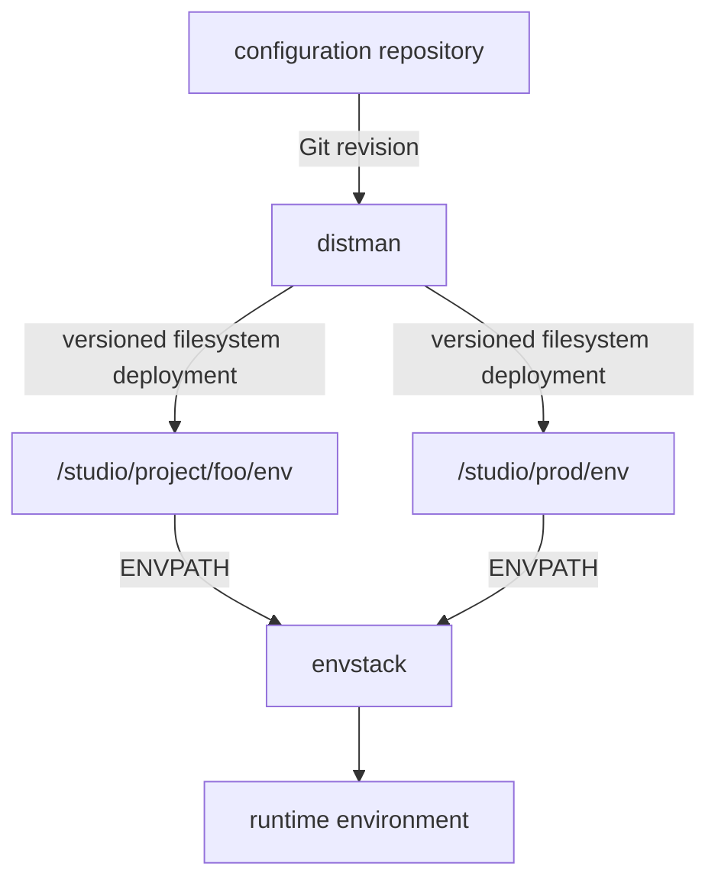

# Distribution Configuration

The repository-level `dist.json` file defines global options, optional
transform steps, and named deployment targets.

## Basic Schema

```json
{
  "author": "pipeline@example.com",
  "options": {
    "match": "commit"
  },
  "pipeline": {},
  "targets": {
    "target-name": {
      "source": "relative/source",
      "destination": "{DEPLOY_ROOT}/destination",
      "options": {},
      "pipeline": {}
    }
  }
}
```

Target options override global options. A target pipeline is combined with the
global pipeline; a target with no `pipeline` key does not run the global
pipeline.

## Environment Paths

Destination paths use brace-delimited variables:

```json
{
  "source": "lib/toolkit",
  "destination": "{DEPLOY_ROOT}/lib/python/toolkit"
}
```

Common settings are:

| Variable | Purpose | Default behavior |
|---|---|---|
| `ENV` | Deployment environment | `prod` |
| `DEPLOY_ROOT` | Shared deployment root | Platform-specific `pipe/<ENV>` location |
| `CACHE_ROOT` | Local cache root | Platform-specific cache under `<ENV>` |
| `CACHE_TTL` | Seconds between remote epoch checks | `600` |
| `IGNORE_MISSING` | Skip missing sources | `false` |
| `BUILD_DIR` | Pipeline working directory | `build` |
| `TRANSFORM_DIR` | Transform subdirectory | `.distman` |
| `LOG_DIR` | Log directory | `~/log/distman` |
| `LOG_LEVEL` | Logging level | `INFO` |
| `MAX_VERSIONS` | Recent versions checked for matches | `5` |

For example, select a development deployment from the shell:

```bash
ENV=dev DEPLOY_ROOT=/studio/apps/dev dist --dryrun
```

distman can also be used alongside
[envstack](https://envstack.dev) to populate these variables, but the two tools
solve different problems. distman answers "which revision is deployed here?"
while envstack answers "which environment definitions participate at runtime,
and in what precedence order?"

## Configuration Repositories

Configuration repositories are a first-class deployment use case. distman does
not need to understand the semantics of an environment file; it only needs a
source path and a destination.

For example, several repositories might independently own configuration:

```text
mytool.git
└── env/mytool.env

studio-config.git
└── env/mytool.env

foo-config.git
└── env/mytool.env
```

Those repositories can then be deployed into their own runtime filesystem
scopes:

```text
/studio/prod/env/mytool.env
/studio/project/foo/env/mytool.env
```

The repository layout and deployment layout do not need to match. That
separation is useful because source ownership and runtime scope are related but
not identical concepts.

## Runtime Composition

One useful mental model is:

```text
Git                     distman                  envstack
──────────────────      ───────────────────      ─────────────────────
source of truth    ->   filesystem deployment   runtime composition
history / review        rollout / rollback      scope / precedence
ownership               deployed revision       environment resolution
```

In practice, that can look like:



Neither project requires the other. envstack can consume files deployed by any
mechanism, and distman can distribute content unrelated to envstack.

If project-specific configuration should override production or facility-wide
configuration, `ENVPATH` should list the project directory first:

```bash
export ENVPATH=/studio/project/foo/env:/studio/prod/env
```

This lets independently versioned inputs advance on their own schedules. For
example, one runtime environment might combine an application release, a shared
studio configuration revision, and a project-specific configuration revision
without forcing them to live in the same repository or branch.

## Wildcard Sources

An asterisk in `source` expands matching files or directories. Numeric
substitutions in `destination` correspond to wildcard captures:

```json
{
  "targets": {
    "scripts": {
      "source": "tools/*.py",
      "destination": "{DEPLOY_ROOT}/bin/%1"
    }
  }
}
```

Each match is processed as a separate deployment object.

## Matching Versions

The `match` option controls how distman recognizes an existing version:

```json
{
  "options": {
    "match": "content"
  }
}
```

- `commit` (default) matches versions using the current Git commit.
- `content` compares the source object with recent deployed versions.

Use `content` when a build artifact can remain identical across commits.

## Missing Sources

Missing sources normally stop a deployment. They can be skipped globally from
the CLI or per target:

```json
{
  "source": "optional/plugin",
  "destination": "{DEPLOY_ROOT}/plugins/optional",
  "options": {
    "ignore_missing": true
  }
}
```

The CLI equivalent is `dist --ignore-missing`.
